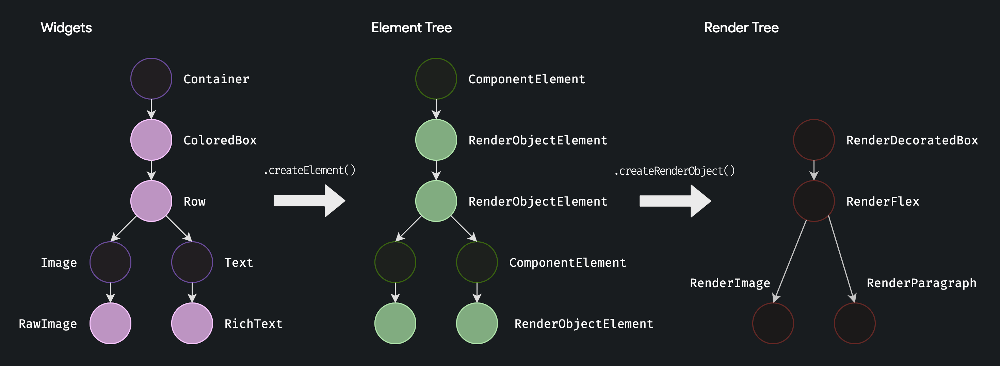

# Introduction To Layout

When Flutter was created, it set out to provide a render architecture that was simple, performant, and modular. Compare this to [HTML](https://developer.chrome.com/articles/layoutng/) or Android [View](https://developer.android.com/reference/android/view/View)s, which have many complex, slow, and implementation-specific layout algorithms.

Most of the widgets you use in Flutter are actually pretty simple and elegant under the hood, there is rarely any magic, so try not to be intimidated by it!

### Constraints go down, Sizes go up

You can think of layout in Flutter as a bunch of functions that take in BoxConstraints and return a Size:


```dart
Size layout(BoxConstraints constraints) {
  final childSize = child.layout(BoxConstraints()));
  child.position(Offset.zero);
  return childSize;
}
```


This is called the [RenderBox](https://api.flutter.dev/flutter/rendering/RenderBox-class.html) protocol, it's simplicity is what enables animations in Flutter to outperform native Android and iOS.

The downside of being simple is that developers have to put in a little extra effort to constrain widgets and avoid those pesky flex overflow, unbounded constraints, and infinite size errors.

The Flutter team made a great article on the design philosophy and performance implications of the RenderObject model: [https://docs.flutter.dev/resources/inside-flutter](https://docs.flutter.dev/resources/inside-flutter)

### The many trees

Before touching RenderObjects, we first need to understand the relationship between the Widget, Element, and Render trees.



If you have some experience in Flutter you are probably familiar with how [State](https://api.flutter.dev/flutter/widgets/State-class.html) works, it's persistent and has lifecycle hooks that tell you when to initialize, build, and dispose.

State is just a fancy delegate for [ComponentElement](https://api.flutter.dev/flutter/widgets/ComponentElement-class.html) so that Flutter doesn't have to expose its ugly internals to widget code, other than that Element and State are essentially the same thing!

[Elements](https://api.flutter.dev/flutter/widgets/Element-class.html) are also our [BuildContext](https://api.flutter.dev/flutter/widgets/BuildContext-class.html), an interface that hides ugly internals.

The Element tree is formed by recursively calling [Widget.createElement](https://api.flutter.dev/flutter/widgets/Widget/createElement.html), Flutter does the dirty work of reactively mounting, building, reparenting, and unmounting them for you.

When [RenderObjectElement](https://api.flutter.dev/flutter/widgets/RenderObjectElement-class.html)s are mounted they call [RenderObjectWidget.createRenderObject](https://api.flutter.dev/flutter/widgets/RenderObjectWidget/createRenderObject.html) to create a [RenderObject](https://api.flutter.dev/flutter/rendering/RenderObject-class.html).

There is a different [Element](https://api.flutter.dev/flutter/widgets/Element-class.html) type depending on how children are structured, for example [ColoredBox](https://api.flutter.dev/flutter/widgets/ColoredBox-class.html) is a [SingleChildRenderObjectWidget](https://api.flutter.dev/flutter/widgets/SingleChildRenderObjectWidget-class.html) that creates a [SingleChildRenderObjectElement](https://api.flutter.dev/flutter/widgets/SingleChildRenderObjectElement-class.html), and [Row](https://api.flutter.dev/flutter/widgets/Row-class.html) is a [MultiChildRenderObjectWidget](https://api.flutter.dev/flutter/widgets/MultiChildRenderObjectWidget-class.html) that creates a [MultiChildRenderObjectElement](https://api.flutter.dev/flutter/widgets/MultiChildRenderObjectElement-class.html).


There is technically no such thing as a "widget tree", widgets are more like user-defined data structures that do not share a root node. The term is often conflated with the element tree, since elements form a global tree and provide context.


### Interactive Example

.png>)

Here's a DartPad that you can play around with:


DartPad - [square-opacity.dart](https://gist.github.com/PixelToast/0d12f9092860c0793e57eb3b9cad2926)


It takes a child (Hello, World!) and ensures the height equals the width, the custom RenderObject also animates opacity to show how [Layer](https://api.flutter.dev/flutter/rendering/Layer-class.html)s work.

The actual layout algorithm itself is quite simple, the annoying part is just the amount of boilerplate:

1. Subclass [LeafRenderObjectWidget](https://api.flutter.dev/flutter/widgets/LeafRenderObjectWidget-class.html), [SingleChildRenderObjectWidget](https://api.flutter.dev/flutter/widgets/SingleChildRenderObjectWidget-class.html), or [MultiChildRenderObjectWidget](https://api.flutter.dev/flutter/widgets/MultiChildRenderObjectWidget-class.html)
2. Implement [createRenderObject](https://api.flutter.dev/flutter/widgets/RenderObjectWidget/createRenderObject.html) / [updateRenderObject](https://api.flutter.dev/flutter/widgets/RenderObjectWidget/updateRenderObject.html) to pass variables to your RenderObject
3. Subclass [RenderBox](https://api.flutter.dev/flutter/rendering/RenderBox-class.html)
4. Mix in [RenderObjectWithChildMixin](https://api.flutter.dev/flutter/rendering/RenderObjectWithChildMixin-mixin.html), [ContainerRenderObjectMixin](https://api.flutter.dev/flutter/rendering/ContainerRenderObjectMixin-mixin.html), or [SlottedContainerRenderObjectMixin](https://api.flutter.dev/flutter/widgets/SlottedContainerRenderObjectMixin-mixin.html)
5. Implement setters to check and call [markNeedsPaint](https://api.flutter.dev/flutter/rendering/RenderObject/markNeedsPaint.html) or [markNeedsLayout](https://api.flutter.dev/flutter/rendering/RenderObject/markNeedsLayout.html)
6. Implement [performLayout](https://api.flutter.dev/flutter/rendering/RenderBox/performLayout.html)
7. Implement [paint](https://api.flutter.dev/flutter/rendering/RenderObject/paint.html)

The original goal of Boxy was to boil this down into a simple, intuitive delegate class, sort of like a [CustomPainter](https://api.flutter.dev/flutter/rendering/CustomPainter-class.html) on steroids.

Check out the introduction to [CustomBoxy](https://pub.dev/documentation/boxy/latest/boxy/CustomBoxy-class.html) next:


[introduction-to-customboxy.md](customboxy/introduction-to-customboxy.md)


### Learn More










